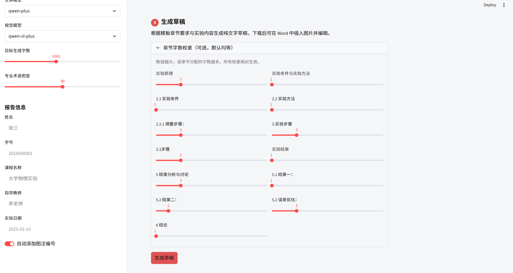
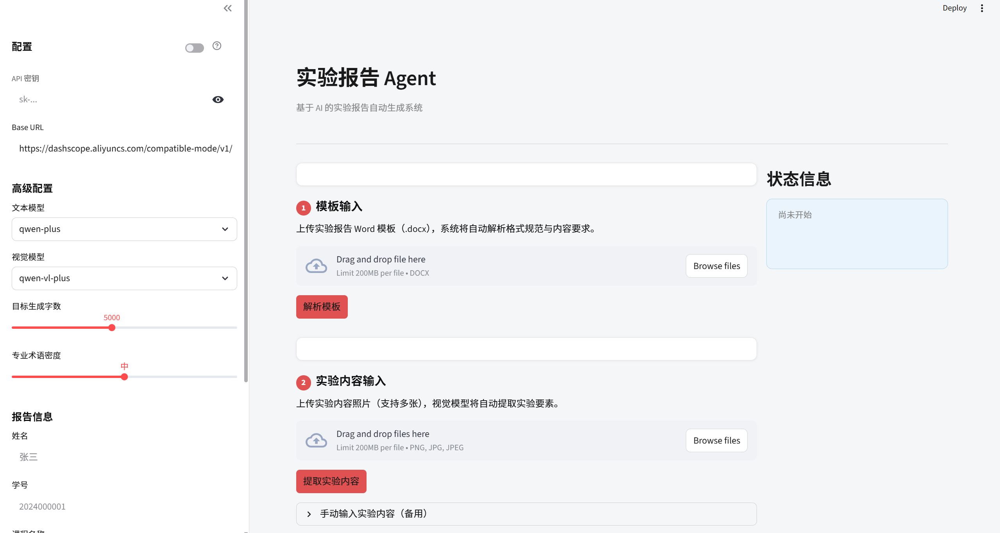
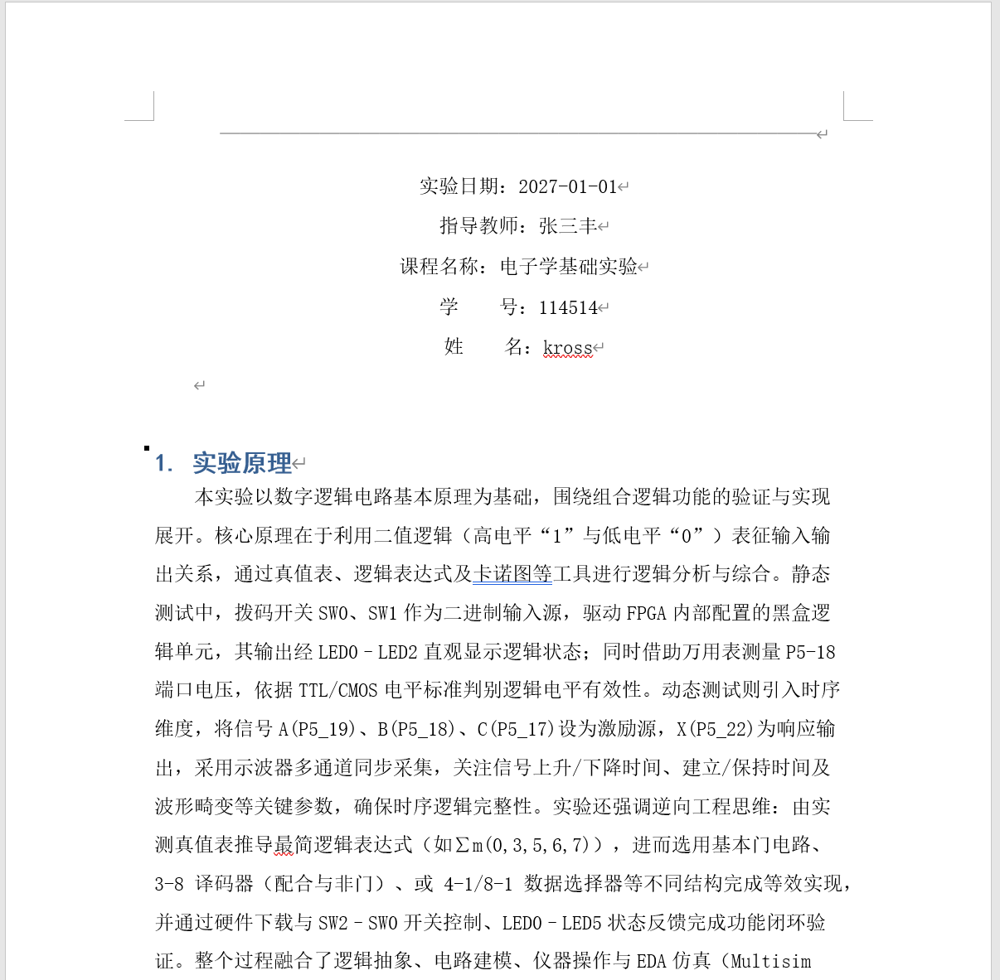

# 实验报告 Agent

一个无框架的基于 AI 的实验报告自动生成系统。输入实验报告模板（Word）和实验文档照片，自动生成符合模板格式要求的完整实验报告，支持个性化配置报告文风以及段落长短。


### <mark>如果这个工具，能为你省下时间去看星星、等花开，那我会很开心</mark>

你只需要：上传实验报告模板、实验文档图片，设置个性化参数，然后发呆五分钟。

它解决这些痛点：
1. 告别 Word 复杂排版，由 LLM 解析模板格式，Python 脚本自动生成并注入内容。
2. 采用体系化 Agent 提示词，全程关联上下文，章节之间不再牛头不对马嘴。
3. 免去在大模型窗口反复ctrlcv，也不用纠结 Markdown 与 Word 格式不兼容。

### <mark>frame文件夹下有某学校某学院很完善的实验报告模板和生成的实验报告实例，模板可以拿来直接用，效果最好。如有个性化模板要求，尽量在提供的实验模板上改动，防止LLM识别失误</mark>

## 工作流程

```
实验报告模板(.docx)
       +               → 解析模板 → 生成草稿(.docx) → 用户编辑文本,插入图片 → 套格式 → 最终报告(.docx)
实验照片(多张图片)
```







1. **解析模板**：从 `.docx` 模板中提取格式规范（页边距、字体、行距等）和章节要求
2. **提取实验内容**：视觉模型读取实验照片，结构化输出实验要素（目的、原理、步骤、数据等）
3. **生成草稿**：语言模型按章节逐一生成正文，用户在 Word 中编辑并插入图片
4. **生成最终报告**：将编辑好的草稿套用模板格式，自动处理图片、插入学生信息和图注编号

---

## 环境要求

- Python 3.9+
- [阿里百炼平台](https://bailian.console.aliyun.com/cn-beijing/?spm=5176.12818093_47.resourceCenter.1.738316d0BLErbl&tab=home#/home) API Key（需开通 `qwen-plus` 文本模型和 `qwen-vl-plus` 视觉模型权限）
千问免费送百万token😍😍

---

## 安装

### 1. 克隆项目

```bash
git clone <repo-url>
cd report_agent
```

### 2. conda 环境（推荐）（可选）
### （避免给自己电脑塞一堆垃圾）
```bash
conda create -n report_agent python=3.10
conda activate report_agent
```

### 3. 安装依赖

```bash
pip install -r requirements.txt
pip install streamlit lxml
```

`requirements.txt` 内容：

```
requests>=2.31.0
Pillow>=10.0.0
python-docx>=1.1.0
pywin32>=306
```

---

## 环境配置

** 所有配置直接在 Streamlit 侧边栏填写：

| 配置项 | 说明 | 默认值 |
|--------|------|--------|
| DashScope API Key | 必填，在侧边栏「API 密钥」处输入 | 无 |
| Base URL | 阿里云兼容模式地址 | 内置默认值，无需修改 |
| 文本模型 | 用于草稿生成 | `qwen-plus` |
| 视觉模型 | 用于图片识别 | `qwen-vl-plus` |

> **可选**：如需持久化配置（如服务器部署），可通过系统环境变量设置 `DASHSCOPE_API_KEY`、`DASHSCOPE_BASE_URL`、`DASHSCOPE_MODEL`，程序启动时自动读取作为侧边栏默认值。

---

## 启动方式

### Streamlit 可视化界面（推荐）

```bash
streamlit run app.py
```

浏览器访问 `http://localhost:8501`。

#### 四步操作流程

| 步骤 | 操作 |
|------|------|
| 1 | 上传 `.docx` 模板 → 点击「解析模板」 |
| 2 | 上传实验图片（支持多张）→ 点击「提取实验内容」；提取失败时可手动输入或编辑 JSON |
| 3 | （可选）调整章节字数权重 → 点击「生成草稿」→ 下载，在 Word 中编辑并插入图片 |
| 4 | 上传编辑好的草稿 → 点击「生成最终报告」→ 下载 |

#### 侧边栏个性化选项

| 选项 | 说明 |
|------|------|
| API Key / Base URL | 必填 API Key，其余有内置默认值 |
| 文本模型 / 视觉模型 | 分别选择用于草稿生成和图片识别的模型 |
| 目标生成字数 | 草稿总字数目标，范围 1000–10000 |
| **专业术语密度** | 低 / 中 / 高，控制生成内容的学术专业程度 |
| **姓名 / 学号 / 课程 / 教师 / 日期** | 填写后自动插入最终报告开头的信息块 |
| **自动添加图注编号** | 开启后在每张图片下方自动插入「图1」「图2」等占位标注 |

#### 章节字数权重

Step 3 中展开「章节字数权重」面板，为每个章节设置 1–10 的相对权重。
例如：实验原理、实验步骤、数据分析设为 3，致谢设为 1，则前三者分得约3倍数于致谢的字数配额。
默认已按经验预填，无需调整即可使用。

---


## 目录结构

```
report_agent/
├── app.py                      # Streamlit 前端入口
├── cli_build_schemas.py        # 解析模板，生成 schema
├── cli_generate_md_draft.py    # 逐章节生成草稿 Word 文档
├── cli_generate_report.py      # 套格式生成最终报告
├── .env                        # 环境变量配置（自行创建）
├── .env.example                # 配置模板
├── requirements.txt
├── frame/                      # 放置实验报告模板 .docx
├── context/                    # 放置实验照片
├── artifacts/                  # 中间产物与输出文件
│   ├── report_format_schema.json
│   ├── report_content_schema.json
│   ├── experiment.json
│   ├── draft.docx
│   └── final_report.docx
└── src/
    ├── config/env.py           # 环境变量读取
    ├── doc_agent/              # Word 文档解析与格式提取
    ├── img_agent/              # 视觉模型调用与图片处理
    └── report_agent/           # 报告生成与格式渲染
```

---

## experiment.json 格式说明

视觉提取失败时可手动编写：

```json
{
  "title": "实验名称",
  "objective": "实验目的",
  "theory": "实验原理",
  "apparatus": ["器材1", "器材2"],
  "steps": [
    {
      "step_id": "1",
      "description": "步骤描述",
      "parameters": {},
      "observation": "观察结果",
      "notes": "注意事项"
    }
  ],
  "data": {
    "tables": [],
    "observations": [],
    "raw_text": "原始数据记录"
  },
  "analysis": "实验结果分析"
}
```

---

## 常见问题

**Q：为什么选择千问大模型？**
A：便宜，免费送百万token,效果理想。且支持多模态识别。

**Q：为什么把实验内容传输接口设计为图片格式？**
A：某学校某学院实验文档很难下载（而且实验文档经常不太完善🤣），所以通过更为灵活的方式读取实验内容😅

**Q：视觉提取结果全为空？**
A：确认 API Key 已开通 `qwen-vl-plus` 权限。若提取仍为空，可在界面展开「查看/编辑提取结果」直接修改 JSON，或使用「手动输入实验内容」备用方案。

**Q：生成字数达不到目标？**
A：逐章节独立调用LLM，每章各有独立 token 预算，不再因总 token 上限截断。可通过章节字数权重面板为重点章节分配更多字数。

**Q：连接超时（ReadTimeout）？**
A：逐章节生成总耗时约为章节数 × 单章时间，已将单次超时设为 300 秒。如网络不稳定，可在 `.env` 中降低 `REPORT_TARGET_CHARS`（如 3000）减少每章生成量。

## <mark>如有建议或者问题,欢迎issue或者邮箱call me</mark>

